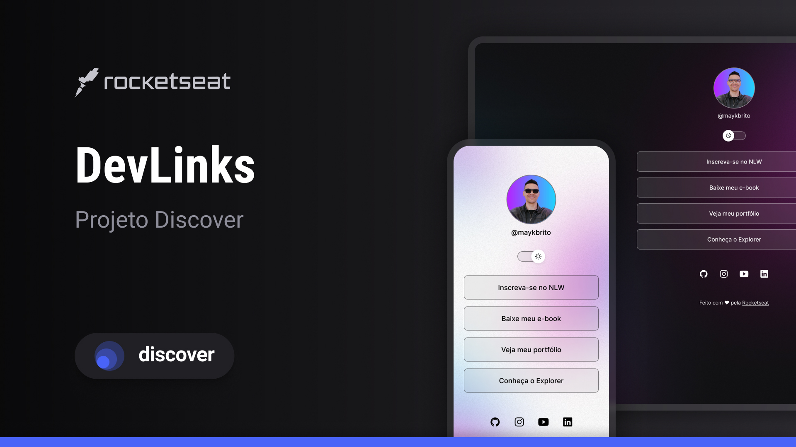

<h1 align="center"> Social Tree </h1>

programa exclusivo e gratuito, promovido pela Rocketseat para ensino de tecnologias WEB.

  <a href="#-tecnologias">Tecnologias</a>&nbsp&nbsp&nbsp;|&nbsp&nbsp&nbsp;
  <a href="#-projeto">Projeto</a>&nbsp&nbsp&nbsp;|&nbsp&nbsp&nbsp;
  <a href="#-layout">Layout</a>&nbsp&nbsp&nbsp;|&nbsp&nbsp&nbsp;
  <a href="#memo-licença">Licença</a>

  

 

  

## 🚀 Tecnologias

Esse projeto foi desenvolvido com as seguintes tecnologias:

- HTML e CSS
- JavaScript
- Git e Github
- Figma

## 💻 Projeto

O social tree é um agregador de links para usar como cartão de visitas online.

## 🔖 Disposição

Você pode visualizar o layout do projeto através [desse link](https://www.figma.com/community/file/1187422022288947321). É necessário ter conta no [Figma](https://figma.com) para acessá-lo.

## 📝Licença

Esse projeto está sob licença do MIT.

---

Feito com ♥ por Kauan [Participe do nosso server do Discord!](https://discord.gg/7zVDmxTSTG)
